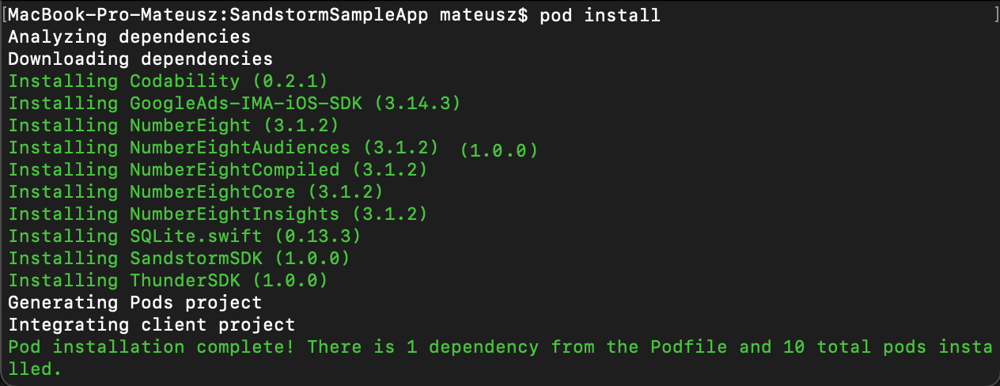
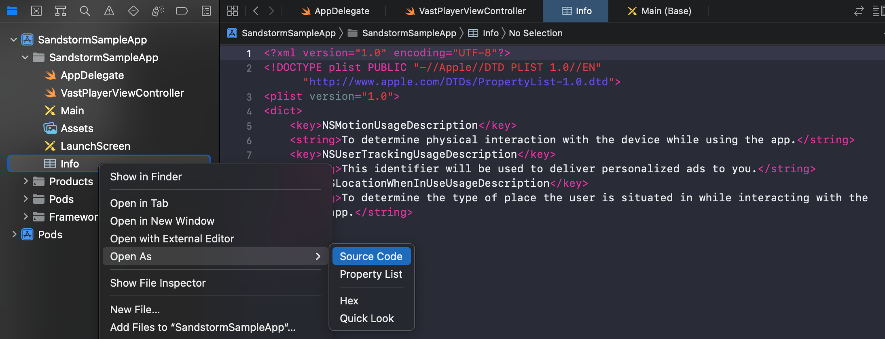

# Overview
**SandstormSDK** provides in-game, intermission and bounty audio ads and allows publishers to generate new revenues from world-class brands. Generator and player for personalized VAST audio advertisement. SandstormSDK is all-you-need SDK for your in-app audio advertisement. The framework provides automatically generated, personalized ads with already prepared player. Use it without additional third party configuration to play the ad in your app.

# Tutorial
Below is a tutorial on how to add the library to your project and how to use it. 

## Requirements
* XCode
* An iOS project 
* An Apple iPhone or iPad
* iOS 11 or greater

## Installation
### Choose SDK versions
You have to decide which version of SDK you want to use. Two available:

**SandstormSDK** - contains SDK functionality + extra user targeting provided by [NumberEight](https://numbereight.ai/); this version will ask user for extra permissions (i.e. location)

> [NumberEight](https://numbereight.ai/) is an AI software, which predicts the live context of a user (e.g. running, commuting) from sensors present in the device, and then packages them neatly into ID-less behavioural audiences (e.g. joggers, frequent shoppers).

**SandstormLite SDK** - contains SDK functionality without extra user targeting; this version won't ask user for extra permissions

Import to your Xcode project `SandstormSDK` or `SandstormLiteSDK` according to your decision.


[CocoaPods](https://guides.cocoapods.org/using/using-cocoapods) is used to integrate `SandstormSDK` into existing iOS project.

In the same directory as your project file, create Podfile, and add the following configuration:

* **SandstormSDK**

```ruby
platform :ios, '10' # or any other deployment target

target "BasicExample" do
   pod 'SandstormSDK'
end
```

* **SandstormLiteSDK**

```ruby
platform :ios, '10' # or any other deployment target

target "BasicExample" do
   pod 'SandstormLiteSDK'
end
```

Then install pods with the command

```bash
pod install
```


## Permissions
Add the following keys to the project’s `Info.plist`.
Although the use of location is optional for the SDK, the keys must still be supplied to pass Apple’s App Review process. 

If you already have these keys in your Info.plist, then you can skip this step.
       
```xml
<!-- Location usage descriptions -->
<key>NSLocationWhenInUseUsageDescription</key>
<string>To determine the type of place the user is situated in while interacting with the app.</string>
<!-- Motion usage descriptions -->
<key>NSMotionUsageDescription</key>
<string>To determine physical interaction with the device while using the app.</string>
<!-- User tracking usage descriptions -->
<key>NSUserTrackingUsageDescription</key>
<string>This identifier will be used to deliver personalized ads to you.</string>
```


## App Privacy Declarations
> Only if you are using **SandstormSDK**, if you are using **SandstormLiteSDK** you can skip this section.

Since the release of iOS 14.5, developers must now declare the data they use in the App Privacy section of App Store Connect.
In order to assist you in declaring the correct data being collected, we have created an [AppStore Data Guide](./docs/guides/appStoreDataGuide.md).


## Consents
To work properly, the SDK needs consents. Depending on the region, please ask the user if they agree to the following.
In some regions, such as the EU, consent is required to allow third-parties to store data on users’ devices for example.


### Consents set to .allowAll
 Below is a list of what is included in the `AdTonosConsent.allowAll` option:<br />
`PROCESSING` - Allow processing of data.<br />
`SENSOR_ACCESS` - Allow use of the device’s sensor data.<br />
`STORAGE` - Allow storing and accessing information on the device.<br />
`USE_FOR_AD_PROFILES` - Allow use of technology for personalised ads.<br />
`USE_FOR_PERSONALISED_CONTENT` - Allow use of technology for personalised content.<br />
`USE_FOR_REPORTING` - Allow use of technology for market research and audience insights.<br />
`USE_FOR_IMPROVEMENT` - Allow use of technology for improving products.<br />
`LINKING_DEVICES` - Allow linking different devices to the user through deterministic or probabilistic means.<br />
`USE_OF_DEVICE_INFO` - Allow use of automatically provided device information such as manufacturer, model, IP addresses and MAC addresses.<br />
`USE_FOR_SECURITY` - Allow use of independent identifiers to ensure the secure operation of systems.<br />
`USE_FOR_DIAGNOSTICS` - Allow processing of diagnostic information using an independent identifier to ensure the correct operation of systems.<br />
`PRECISE_GEOLOCATION` - Allow use of precise geolocation data (within 500 metres accuracy).

### Consents set to .none
It is possible to start SDK with consents set to `AdTonosConsent.none`, but it will not collect data about the user then, so the advertisement will not be personalized appropriately to the user.


## Start SDK and create builder

### Import
First import `SandstormSDK` in all files that use the SDK.

```swift
import SandstormSDK
```

### Initialization
The first necessary step in the project is to call the `ATSandstormSDK.shared.initialize` method. It should be called at the start of the application, when the other components are created. The method is safe to be called multiple times. The Initialize method must be called every time the application starts. Below is an example of how this should be done:

* Use the following code to initialize `SandstormSDK` in the AppDelegate’s `application:willFinishLaunchingWithOptions:` method:

```swift
func application(_ application: UIApplication, willFinishLaunchingWithOptions launchOptions: [UIApplication.LaunchOptionsKey : Any]? = nil) -> Bool {
    ATSandstormSDK.shared.initialize(with: launchOptions)
  
    return true
}
```

* If you don't want to do initialization in AppDelegate but e.g. in ViewController, you can also pass `nil` as a parameter.

```swift
ATSandstormSDK.shared.initialize(with: nil)
```

### Set NumberEight key
**SandstormLiteSDK** - skip this step.

**SandstormSDK** - set the NumberEight key you get from AdTonos with the method:

```swift
ATSandstormSDK.shared.setNumberEightKey("XXXX")
```

> The method must be called before the start() method

### Start

The library requires certain permissions and user consents for data collection. Therefore, one of the initial screens should show the user the terms and conditions containing the necessary information about the use and processing of personal data. This is done when the user first interacts with the application, so this is a good time to call the Start method. The method takes the consent flag as a parameter and then asks the user for the system permissions necessary for the application to work. The `start` method must be called every time the application starts. Additionally, the `loadLatestConsents` method can be used, which returns the most recently granted consents. Below is an example of how this can be done:

> Important: `start` must be called when the application is active, otherwise the idfa permission popup will not be shown to the user.<br />

Pass the consent as a function parameter:

* In case NumberEight will be used `.allowAll`.
* In case NumberEight will **not** be used  `.none`.

```swift
ATSandstormSDK.shared.start(with: .allowAll)
```
To check if *SandstormSDK* is started it is possible to use the `isStarted` variable.

```swift
_ = ATSandstormSDK.shared.isStarted
```

**Save consents**

In case you want to change the consents, you can use the method `save`.

```swift
ATSandstormSDK.shared.save(consent: .none)
```
In a situation where previously profiling was disabled, then consent will be given, which activates profiling, system permissions will be shown.

>Remember to add the keys to Info.plist, which are described above.

**Load consents**

You can also get the last set consents using the method `loadLatestConsent`.

```swift
ATSandstormSDK.shared.loadLatestConsent()
```
### Generate VAST link
To generate a VAST link, create a builder and then set the AdTonos key. 

>The best way to create a builder is to use `ThunderObserver` and create it when the `onStarted` callback is invoked. 

Moreover if you want to use a language other than preferred in the system, you can set it with ``set(lang:)``. 

>Language must be provided in **ISO-639-1** or **ISO-639-2** format. 

It is also possible to define the type of advertisement. Possible types are **.regular**, which is the default, and **.bannerAd**.

```swift
let builder = ATSandstormSDK.shared.createBuilder()
   .set(adTonosKey: "XXXXX") //Sets developer key.
   .set(lang: "en") //Sets user language if different than a system defined
   .set(adType: .regular) //Sets adType (.regular, .bannerAd)

```
In the [Banners](#Banners) section you can read more about bannerAd.

* **AdTonos key** - Where to find AdTonosKey? 
It's provided by AdTonos on the portal and can be extracted from the link:

 > [https://play.adtonos.com/xml/XXXXX/vast.xml]()
 
 where XXXXX is the AdTonos key. AdTonos usually provides two links, one for testing purposes and one for release.
 During development testing key shall be used.

## Playing ads
The next step is to make a request for ads using the `requestForAds` method. Then wait for the ads to be obtained and to run the ads. A callback can be useful here to provide information about the current state and any errors. Below is an example of a class that will cause an advertisement to play.

### Request for ads

To make an ad request use the method  `requestForAds(with:)`and pass the builder you created earlier as a parameter.

```swift
ATSandstormSDK.shared.requestForAds(with builder: builder)
```

### Check if the ad is available
The  `isAdAvailable`  variable allows you to check if the ad is available.

```swift
ATSandstormSDK.shared.isAdAvailable // returns true or false
```


### Manage player

- To **start** playing the advertisements use the  `playAd()`  method.
    

```swift
ATSandstormSDK.shared.playAd() // returns true/false depending on whether the ad has started playing.
```

- To **pause** the ad, use the function  `pauseAd()`.
    

```swift
ATSandstormSDK.shared.pauseAd() // returns true/false depending on whether the ad has been paused.
```

- To do **clear** use  `clear()`. It clears any ad state (prepared / played / paused).

```swift
ATSandstormSDK.shared.clear()
```
### ThunderObserver
The best way to request for ads is to listen to the callback informing that the SDK is started. To be notified of this state conform your class to  `ThunderObserver`  and use  `add(thunderObserver:)`method.

First:

```swift
import ThunderSDK
```
Then:

```swift
extension YourViewController: ThunderObserver { 
   func onStarted(success: Bool, error: ATError?) {
        if success {
            let builder = adTonos.createBuilder().set(adTonosKey: "XXXXX")
            _ = adTonos.requestForAds(with: builder)
        }
    }
 }
```

An observer should be added 

```swift
ATSandstormSDK.shared.add(thunderObserver: self)
```

e.g. in `viewDidLoad()`

```swift
override func viewDidLoad() {
        super.viewDidLoad()
        ATSandstormSDK.shared.add(thunderObserver: self)
}
```
### SandstormObserver
The SDK also allows you to observe the current state related to the player. To be notified for related callbacks **add** an observer. Conform your class to  `SandstormObserver`  and use  `add(sandstormObserver:)`method.

E.g.

```swift
extension YourViewController: SandstormObserver { 

    func onVastAdsLoaded() {
        statusButton.text = "Single ad is loaded and ready to play"
    }

    func onVastError(_ error: AdTonosVastError) {
        statusButton.text = "Error occurred during ads request or any ads interaction like playing, pausing"
    }

    func onVastAdsAvabilityExpired() {
        statusButton.text = "Ads expired."
    }

    func onVastAdsStarted() {
        statusButton.text = "Sequence of one or more ads in VAST starts to play"
    }

    func onVastAdPaused() {
        statusButton.text = "Single ad is paused"
    }

    func onVastAdPlayStarted() {
        statusButton.text = "Single ad is played"
    }

    func onVastAdsEnded() {
        statusButton.text = "Sequence of one or more VAST ads has ended"
    }
 }
```
An observer should be added 

```swift
ATSandstormSDK.shared.add(sandstormObserver: self)
```

e.g. in `viewDidLoad()`

```swift
override func viewDidLoad() {
        super.viewDidLoad()
        ATSandstormSDK.shared.add(sandstormObserver: self)
}
```

To **remove** an observer to not be notified for related callbacks anymore use  `remove(sandstormObserver:)`  method.

```swift
ATSandstormSDK.shared.remove(sandstormObserver: self)
```

To **remove all** previously added observers to not be notified for related callbacks anymore use  `removeAllObservers()`  method.

```swift
ATSandstormSDK.shared.removeAllObservers()
```


**The observer includes functions that report the following events:**

- `onVastAdPaused()` - Is invoked when a single ad is paused

- `onVastAdPlayStarted()` - Is invoked when a single ad is played

- `onVastAdsAvabilityExpired()` - Is invoked when already loaded ads become expired

- `onVastAdsEnded()` - Is invoked when the sequence of one or more VAST ads has ended

- `onVastAdsLoaded()` - Is invoked when single ad is loaded

- `onVastAdsStarted()`- Is invoked when a sequence of one or more ads in VAST starts to play


- `onVastError(AdTonosVastError)` - Whenever an error occurred during ads request or any ads interaction like playing, pausing

### Dispose

Use `dispose` to dispose any collected data related to personalized advertisements and prevent further gathering if needed.

```swift
ATSandstormSDK.shared.dispose()
```

## Banners<a id='Banners'></a>
The SDK has the ability to play audio ads with a banner. If you want to use such an advertisement use the `set(adType: .bannerAd)` method in `ThunderVastURLBuilder`

```swift
let builder = ATSandstormSDK.shared.createBuilder()
   .set(adTonosKey: "XXXXX") //Sets developer key.
   .set(lang: "en") //Sets user language if different than a system defined
   .set(adType: .bannerAd) //Sets .bannerAd

```

### Setting the banner position

The SDK offers to set the banner position, to do this use the following method:

```swift
ATSandstormSDK.shared.setAdBannerPosition(.bottom) 
```

It is possible to display the banner view at the **top** of the screen or at the **bottom**.

By default, the banner will be displayed at the **top** of the screen. The method needs to be called before the ads are played.